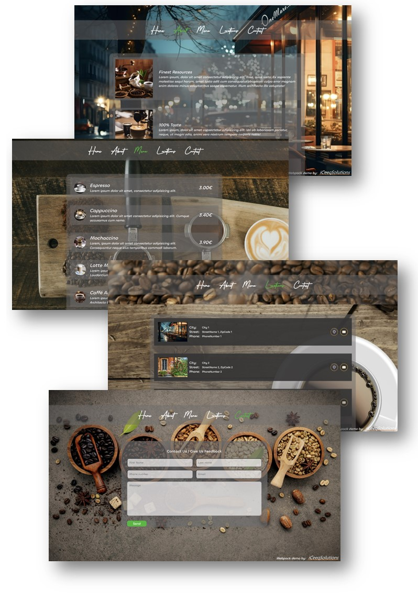

# Simple Webpack Demo Page - Coffee Shop

  Webpack Demo Page by <a href="https://iceeqsolutions.fi/">iCeeqSolutions</a>

## About

The Coffee Shop demo is a simple example of a web application featuring dynamic content genereation. In the project, each page has been written as a separate module for better code readability and control.

In order to boost page performance, we've used Webpack. Webpack automatically compress and optimize the files before hosting them. The JavaScript files e.g. will get bundled into a single file.

When clicking on a link in the navbar, the bundled JavaScript -file will be accessed and the script associated with the clicked link will get executed, which in turn dynamically generates the page.

The text content and some of the images has been stored in arrays. During page rendering, the page content will be read from the arrays. This setup makes it easy to add, remove and modify the site content at any point in time.

## Demo

👁️ [Live Demo](https://iceeqsolutions.github.io/webpack-demo-coffee-shop/)

## Built with

- JavaScript
- CSS
- Webpack
- NPM

## Features

- Dynamic content generation
- Responsive design
- Custom made method for adding form elements
- Simple form validation

## Screenshots

  
